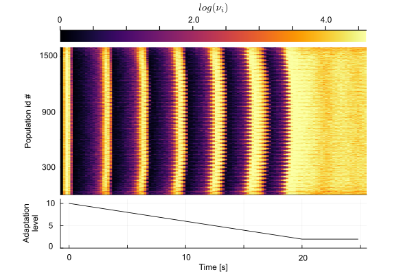

# NeuralFields.jl
## The general idea
*NeuralFields.jl* is an open-source Julia based simulator of a network of interacting populations of spiking neurons.
Instead of simulating the activity of spiking neurons, we integrate for each node the membrane potential density $p(v,t)$
that follows a Fokker-Planck equation [1]. Inter nodes interaction are mediate via the mean and variance of the synaptic current, this allows
to implement a masivelly parallel integration.
Finite-size fluctuations are included at each node following the idesa developed in [1,2].

For the networks parameter and synaptic connections we use the initialization file Modules.ini and Connectivity.ini of the PERSEO spiking network simulator [3]

If you used this tool in your work consider to cite us in [2]

## How to use
All the required functions are contained in the module NeuralField.jl. An exemple of a large neural field with step by stepe guidance can be found in Example.jl 

## Sleep-Awake transittion
As a use-case we implement a neural field in that shows slow wawes alike those observed during sleep [4]. By modulating in time the strenght of the adptation we induce a transition to an high firing rate states that mimcs the awake state

## References

[1] Mattia, Maurizio, and Paolo Del Giudice. "Population dynamics of interacting spiking neurons." Physical Review E 66.5 (2002): 051917.

[2] Vinci, Gianni V., Roberto Benzi, and Maurizio Mattia. "Self-consistent stochastic dynamics for finite-size networks of spiking neurons." Physical Review Letters 130.9 (2023): 097402.

[3] Mattia, Maurizio, and Paolo Del Giudice. "Efficient event-driven simulation of large networks of spiking neurons and dynamical synapses." Neural computation 12.10 (2000): 2305-2329.

